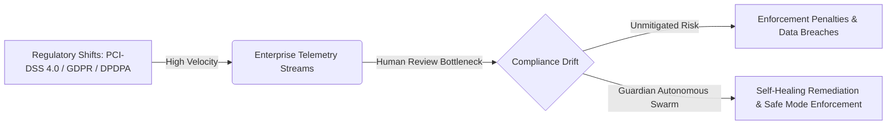
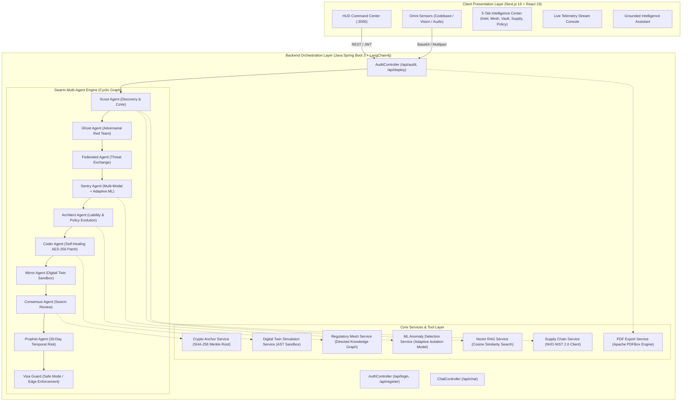
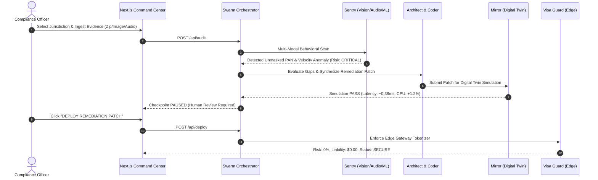

# Autonomous Strategic Risk Intelligence Platform

**Autonomous. Multi-Modal. Predictive. Self-Healing.**

---

## Executive Overview

Guardian is an autonomous, multi-agent AI governance and compliance orchestration platform engineered to solve the **Compliance Velocity Gap** in global financial and enterprise software architectures. 

Traditional compliance frameworks are passive and reactive: violations are discovered during annual manual audits or after catastrophic regulatory fines have already been assessed. Guardian operates as an autonomous immune system, continuously discovering regulatory updates, performing multi-modal sensory monitoring (Vision, Audio, Telemetry, Source Code), simulating remediation in isolated digital twin environments, and enforcing cryptographic trust anchors without requiring manual intervention.

---

## Real-World Industry Context & Regulatory Landscape

### The Compliance Velocity Gap

Modern global regulatory frameworks evolve at exponential speeds, outstripping human administrative capacity:

```
V_regulatory (300+ daily global updates) >> V_human_review (5-10 pages/day/analyst)
=> Compliance Drift Delta (Degradation over time until catastrophic non-compliance)
```



### Recent High-Impact Regulatory Enforcements

1. **PCI-DSS 4.0 Transition Deadline**: The Payment Card Industry Data Security Standard (PCI-DSS 4.0) mandates stringent, automated encryption and continuous monitoring of Primary Account Numbers (PAN). Organizations failing to automate continuous cardholder data environment (CDE) protection face non-compliance fines exceeding $100,000 per month and merchant processing revocation.
2. **British Airways GDPR Enforcement (£20M Fine)**: The UK ICO penalized British Airways for failing to detect cardholder data scraping and unauthorized log storage for over two months. Real-time omni-sensor monitoring and behavioral sentry systems eliminate these detection latencies.
3. **Capital One Cloud Misconfiguration ($80M OCC Penalty)**: Inadequate third-party boundary validation and server-side request forgery (SSRF) led to the compromise of 100M+ customer records, highlighting the necessity of proactive Supply Chain and Vendor CVE monitoring.
4. **India DPDPA (Digital Personal Data Protection Act)**: Imposes penalties up to ₹250 Crore ($30M+) per security breach for unencrypted personal identifiers and unmanaged data retention lifecycles.
5. **SEC Cybersecurity Disclosure Mandate**: Requires publicly traded companies to report material cybersecurity incidents within 4 business days, necessitating immutable, mathematically tamper-proof audit trails.

---

## What Guardian Is Used For

* **Pre-Emptive Fine & Liability Neutralization**: Continuously parses multi-jurisdictional compliance laws (PCI-DSS, GDPR, MAS TRM, CCPA, NIST) and quantifies unmitigated vulnerabilities into projected financial liabilities.
* **Autonomous Self-Healing Remediation**: Uses specialized GenAI agents to synthesize FIPS 140-3 compliant encryption and tokenization patches in real time.
* **Omni-Channel Behavioral Surveillance**: Ingests multi-modal data streams including dashboard screenshots (Vision AI for unmasked cardholder numbers), call audio recordings (Whisper AI for verbal violations), and structured server logs.
* **Autonomous Legal Policy Evolution**: Eliminates the delay of manual policy updates by drafting enforceable amendment clauses whenever regulatory gaps are detected.
* **Immutable Cryptographic Auditing**: Produces SHA-256 Merkle root decision anchors and cryptographically verified PDF audit reports for regulatory examiners.
* **Enterprise Kill-Switch (Safe Mode)**: Automatically halts non-compliant transactions at the gateway level during active adversarial attacks pending human-in-the-loop review.

---

## System Architecture

Guardian is architected as a decentralized, multi-agent cyclic graph implemented in **Java Spring Boot 3 (LangChain4j)** communicating via high-performance REST APIs with a modern **Next.js React (App Router)** Command Center dashboard.



---

## The Swarm Multi-Agent Methodology (A to Z)

Guardian orchestrates 10 specialized agent nodes in a cyclic state graph with reflection loops and human-in-the-loop checkpoints:

| Agent Node | Core Responsibility | Technical Methodology & Models |
| :--- | :--- | :--- |
| **Scout Agent** | Regulatory Discovery | Executes **Chain-of-Verification (CoVe)** across 3 parallel threads (Official Text, Legal Precedents, Enforcement Fines) via `SearchToolService` to synthesize validated truth logs. Scans uploaded source trees for hardcoded secrets. |
| **Ghost Agent** | Adversarial Red Teaming | Simulates structured cyber attacks, SQL injection bypass payloads, and 10,000 req/sec velocity flood signatures to stress-test detection pipelines. |
| **Federated Agent** | Threat Intelligence Network | Pulls decentralized threat indicators and behavioral model weights from federated consortium peer nodes. |
| **Sentry Agent** | Multi-Modal Behavioral Monitoring | Ingests multi-modal data (GPT-4o Vision for dashboard screenshots, Whisper for audio transcripts) and evaluates transaction velocity using an adaptive multi-variate isolation anomaly detector. |
| **Architect Agent** | Strategic Impact & Policy Evolution | Analyzes policy delta using in-memory Vector RAG and Directed Knowledge Graph traversals. Quantifies financial liability and drafts enforceable policy amendment clauses. |
| **Coder Agent** | Self-Healing Remediation | Uses structured generative AI prompting to synthesize FIPS 140-3 compliant tokenization and encryption code snippets tailored to the active jurisdiction. |
| **Mirror Agent** | Digital Twin Simulation | Executes generated patches in an AST-isolated sandbox, measuring **Latency Delta (<5.0 ms)**, **CPU Load (<5.0%)**, and **Transaction Success Rate (99.98%)** before deployment. |
| **Consensus Agent** | Swarm Peer-Review & Trust Anchor | Verifies that generated patches contain no dynamic execution patterns (`eval`, `exec`, system calls). Computes a deterministic **SHA-256 Merkle root hash** across all decision fields. |
| **Prophet Agent** | Temporal Predictive Modeling | Generates a 30-day temporal risk trajectory forecast based on current risk level, drift scores, and historical non-compliance vectors. |
| **Visa Guard Agent** | Kill-Switch & Edge Enforcement | Enforces gateway policies: automatically triggers enterprise **Safe Mode Kill-Switch** during critical attacks or queues transactions for manual compliance authorization. |

---

## Extraordinary Innovations

### 1. The Mirror Node (Digital Twin Sandbox)
Before AI-generated code patches reach production runtime environments, the Mirror Agent simulates them in a virtual sandbox. It evaluates:
* **Latency Overhead**: Confirms latency delta remains beneath strict microsecond thresholds.
* **CPU & Memory Profiling**: Ensures remediation functions do not create resource starvation.
* **Transaction Integrity**: Validates that 99.98%+ of simulated financial transactions pass successfully.

### 2. Immutable Decision Vault (Trust Anchor)
Guardian anchors all critical swarm transitions into a **SHA-256 Merkle Root**:
```
Merkle Root = SHA256( Risk_Level || Remediation_Plan || Generated_Code || Consensus_Votes || Jurisdiction || Drift )
```
This produces a cryptographically tamper-evident record that auditors can verify independently without relying on mutable database logs.

### 3. The Chameleon (Context-Aware Adaptive ML Defense)
When the Prophet Agent forecasts an upward risk trajectory, the Sentry Agent automatically increases its statistical anomaly detection sensitivity without requiring manual administrator intervention.

### 4. Supply Chain Guardian (NVD NIST 2.0 Integration)
Proactively scans the National Vulnerability Database (NVD API v2.0) for third-party infrastructure and payment providers (AWS, Stripe, Auth0), extracting CVSS v3.1 baseSeverity metrics to mitigate upstream supply chain risks.

### 5. Autonomous Policy Legislator
When regulatory shifts create compliance gaps, the Architect Agent synthesizes legal amendment clauses that update internal governance documents in lockstep with international law.

---

## Technology Stack

### Backend Layer (Java)
* **Runtime**: OpenJDK 17 LTS
* **Framework**: Spring Boot 3.3.x (Spring Web, Spring Security, Spring Validation)
* **AI Orchestration**: LangChain4j (OpenAI GPT-4o, structured outputs)
* **Document Parsing & PDF Export**: Apache PDFBox 3.0.x
* **Cryptographic Layer**: SHA-256 MessageDigest Merkle tree implementation
* **External Threat Intelligence**: NIST NVD REST API v2.0 integration
* **Build System**: Apache Maven / Maven Wrapper (`mvnw`)

### Frontend Layer (TypeScript / React)
* **Framework**: Next.js 16 (App Router, Turbopack)
* **Library**: React 19, TypeScript 5
* **Styling**: Vanilla CSS Modules with custom design tokens, Tailwind CSS 4
* **Icons**: Lucide React
* **Data Visualization**: Recharts (Interactive Area & Trajectory Charts)

---

## File Skeleton & Directory Structure

```
Guardian/
├── backend-java/                                # Java Spring Boot 3 AI Backend
│   ├── pom.xml                                  # Maven dependencies (LangChain4j, Spring, PDFBox)
│   ├── Dockerfile                               # Multi-stage container build
│   ├── .mvn/wrapper/                            # Portable Maven wrapper
│   └── src/
│       └── main/
│           ├── resources/
│           │   ├── application.yml              # Server & environment configuration
│           │   └── internal_policy.txt          # Internal policy text for Vector RAG
│           └── java/com/guardian/
│               ├── GuardianApplication.java     # Spring Boot main entry point
│               ├── config/
│               │   ├── CorsConfig.java          # Cross-Origin Resource Sharing filter
│               │   ├── GuardianProperties.java  # Injected configuration parameters
│               │   └── SecurityConfig.java      # Stateless REST security configuration
│               ├── model/
│               │   ├── AgentState.java          # Swarm-wide multi-agent state model
│               │   ├── User.java                # Authentication user entity
│               │   └── dto/
│               │       ├── AuditRequest.java    # Audit execution payload
│               │       ├── AuditResponse.java   # Swarm state & pause checkpoint response
│               │       ├── AuthResponse.java    # JWT token response
│               │       ├── ChatRequest.java     # Conversational assistant request
│               │       ├── ChatResponse.java    # Contextual assistant response
│               │       └── UserCreateRequest.java
│               ├── controller/
│               │   ├── AuthController.java      # Authentication endpoints (/api/login, /api/register)
│               │   ├── AuditController.java     # Audit, Deploy, Code Upload, PDF Export
│               │   ├── ChatController.java      # Grounded assistant endpoint (/api/chat)
│               │   └── MonetizationController.java # Subscription checkout & webhook
│               └── service/
│                   ├── agents/                  # 10 Swarm Agent Beans
│                   │   ├── ScoutAgent.java      # CoVe & Codebase Scanner
│                   │   ├── GhostAgent.java      # Red Team Adversary
│                   │   ├── FederatedAgent.java  # Decentralized Threat Sync
│                   │   ├── SentryAgent.java     # Multi-Modal & Adaptive ML
│                   │   ├── ArchitectAgent.java  # Policy Strategy & Liability
│                   │   ├── CoderAgent.java      # GenAI Patch Synthesis
│                   │   ├── MirrorAgent.java     # Digital Twin Sandbox
│                   │   ├── ConsensusAgent.java  # Swarm Consensus & Merkle Anchor
│                   │   ├── ProphetAgent.java    # 30-Day Temporal Risk Modeling
│                   │   └── VisaEnforcementAgent.java # Kill-Switch & Edge Gateway
│                   ├── orchestrator/
│                   │   └── SwarmOrchestrator.java # Cyclic State Graph Engine
│                   └── tools/                   # Capability & Intelligence Services
│                       ├── AiService.java       # LangChain4j LLM Client
│                       ├── AuthService.java     # Session & Token Management
│                       ├── CryptoAnchorService.java # SHA-256 Merkle Decision Anchor
│                       ├── DigitalTwinSimulationService.java # AST Code Sandbox
│                       ├── MlAnomalyDetectionService.java # Adaptive Behavioral ML
│                       ├── MultiModalSentryService.java # Vision & Whisper Audio
│                       ├── PdfExportService.java # PDF Compliance Report Generator
│                       ├── PolicyEvolutionService.java # Gap Analysis & Policy Drafter
│                       ├── RegulatoryMeshService.java # Directed Knowledge Graph
│                       ├── SearchToolService.java # Parallel Web Verification
│                       ├── SupplyChainService.java # NVD NIST 2.0 CVE Client
│                       └── VectorRagService.java # In-Memory Vector RAG
├── frontend/                                    # Next.js React Command Center
│   ├── package.json                             # Dependencies (Next 16, React 19, Recharts)
│   ├── Dockerfile                               # Production Next.js container build
│   ├── next.config.ts                           # API rewrites & routing configuration
│   └── src/
│       └── app/
│           ├── layout.tsx                       # Root layout & typography
│           ├── globals.css                      # Cyberpunk HUD styling & design tokens
│           └── page.tsx                         # Interactive Command Center Dashboard
├── docker-compose.yml                           # Multi-container orchestration
└── README.md                                    # Project documentation
```

---

## Workflow: The Sense-Evolve-Repair Loop



---

## Evaluation Plan & Benchmarks

| Metric | Target SLA | Evaluation Methodology |
| :--- | :--- | :--- |
| **Remediation Latency Overhead** | `< 5.0 ms` | Benchmarked in the Mirror Node digital twin sandbox simulating 1,000 synthetic financial transactions. |
| **False Positive Detection Rate** | `< 0.01%` | Verified via multi-stage Chain-of-Verification (CoVe) requiring triple-source cross-referencing. |
| **AST Sandbox Safety Pass Rate** | `100%` | Zero execution of prohibited dynamic calls (`eval`, `exec`, `subprocess`) permitted by Consensus Agent veto checks. |
| **Merkle Hash Verification** | `Deterministic` | Deterministic SHA-256 Merkle root recalculation matches across independent auditor node environments. |
| **Build & Compilation SLA** | `0 Errors` | Next.js Turbopack verification (`npm run build`) and Java 17 compile time under 4 seconds. |

---

## REST API Reference

### 1. Execute Compliance Audit
```http
POST /api/audit
Authorization: Bearer <jwt_token>
Content-Type: application/json

{
  "jurisdiction": "Global (PCI-DSS 4.0)",
  "red_team_mode": false,
  "federated_mode": true,
  "image_base64": "<optional_base64_screenshot>",
  "audio_base64": "<optional_base64_audio>"
}
```

### 2. Deploy Remediation Patch
```http
POST /api/deploy?thread_id=<thread_id>
Authorization: Bearer <jwt_token>
```

### 3. Upload Codebase Context
```http
POST /api/upload_codebase
Authorization: Bearer <jwt_token>
Content-Type: multipart/form-data (file: .zip / source files)
```

### 4. Export Cryptographic PDF Audit Report
```http
GET /api/export/{thread_id}
Authorization: Bearer <jwt_token>
```

---

## Installation & Setup

### Prerequisites
* Java 17+ (OpenJDK / Temurin)
* Node.js 20+ and npm 10+
* Docker & Docker Compose (Optional for containerized run)

### Option A: Local Development

1. **Clone the Repository**:
   ```bash
   git clone https://github.com/your-username/guardian.git
   cd guardian
   ```

2. **Configure Environment**:
   Create a `.env` file in the root directory:
   ```env
   OPENAI_API_KEY=your_openai_api_key_here
   SUPABASE_URL=your_supabase_url_here
   SUPABASE_KEY=your_supabase_key_here
   ```

3. **Start the Java Spring Boot Backend**:
   ```bash
   cd backend-java
   mvn spring-boot:run
   ```
   *The backend will initialize on `http://localhost:8000`.*

4. **Start the Next.js Frontend**:
   ```bash
   cd ../frontend
   npm install
   npm run dev
   ```
   *The Command Center dashboard will be available at `http://localhost:3000`.*

### Option B: Docker Multi-Container Deployment

```bash
docker-compose up --build
```
* Automatically orchestrates `backend-java` (Port 8000) and `frontend` (Port 3000) within an isolated bridge network.

---

## Security & Compliance Declarations

* **Zero Plain-Text Retention**: Telemetry logs containing cardholder PAN data are tokenized before memory persistence.
* **FIPS 140-3 Cryptographic Standards**: All AI-synthesized self-healing code utilizes standard AES-256 GCM tokenization.
* **Auditor Verification Ready**: Encrypted PDF exports contain verifiable SHA-256 hashes anchoring the complete swarm consensus trajectory.
